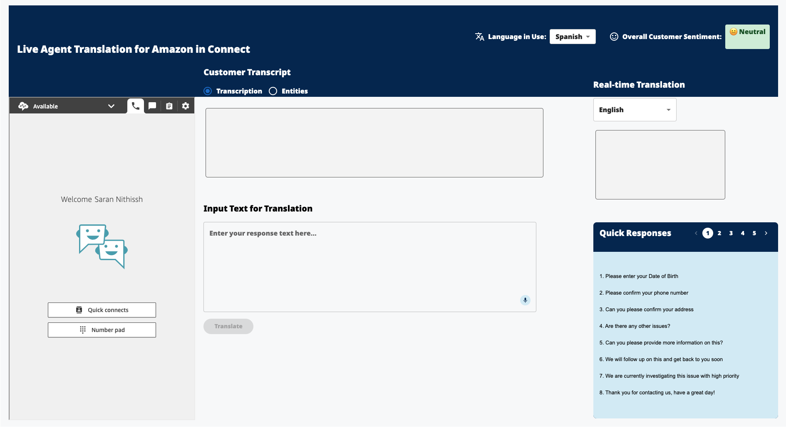
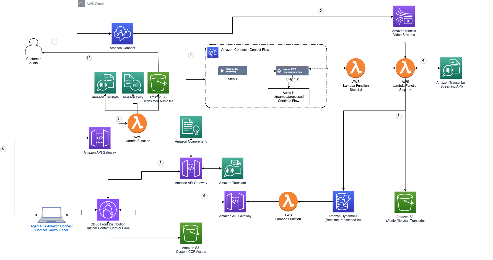

# Multilingual Contact Center

## Overview:-
This is a react based application for the multilingual contact center solution that helps call centres overcome language barriers between call center agents and customers. Using AWS services like Amazon Connect, Amazon Transcribe, Amazon Translate, and Amazon Polly, this solution provides near real-time translation capabilities, allowing agents to effectively communicate with customers who speak different languages.

## Disclaimers
Customers are responsible for making their own independent assessment of the information in this document.

This document:

(a) is for informational purposes only,

(b) references AWS product offerings and practices, which are subject to change without notice,

(c) does not create any commitments or assurances from AWS and its affiliates, suppliers or licensors. AWS products or services are provided "as is" without warranties, representations, or conditions of any kind, whether express or implied. The responsibilities and liabilities of AWS to its customers are controlled by AWS agreements, and this document is not part of, nor does it modify, any agreement between AWS and its customers, and

(d) is not to be considered a recommendation or viewpoint of AWS.

Additionally, you are solely responsible for testing, security and optimizing all code and assets on GitHub repo, and all such code and assets should be considered:

(a) as-is and without warranties or representations of any kind,

(b) not suitable for production environments, or on production or other critical data, and

(c) to include shortcuts in order to support rapid prototyping such as, but not limited to, relaxed authentication and authorization and a lack of strict adherence to security best practices.

All work produced is open source. More information can be found in the GitHub repo.

## Description:-
This solution provides near real-time translation chat support through Amazon Connect, Amazon Transcribe, and serverless code through AWS Lambda. Translations that would take hours to complete manually are performed in moments and read back, in life-like speech, and in a member’s chosen language through Amazon Polly. This solution is designed to be a cost-effective, scalable, and secure solution for organizations that need to provide multilingual support to their customers.



## High Level Architecture:-

The architectural diagram for AWS Backend is:



# Prerequisites
For the prerequisites, we need to have the following:

## Frontend Prerequisites:
1. Node.js and npm 
2. React and Vite
3. AWS SDK for JavaScript
4. Material UI
5. Amazon Connect Streams

## Backend Prerequisites:
For deploying the backend, we need to follow the steps as provided in this blog:
[Building a multilingual contact center](https://aws.amazon.com/blogs/publicsector/building-a-multilingual-contact-center-for-medicaid-agencies-on-aws/)


# Deployment Guide:-
-> First we need to deploy the backend as shown in the backend prerequisites, then use the resources such as API to add to the Frontend.

## Running Locally:-

-> Clone the repo and navigate to the frontend directory:

To run the frontend locally, follow the steps:

1. We need to create https certificate and save it. 
   
2. Allowing Origins for Amazon Connect:
   - Go to AWS console and go to the Amazon Connect service.
    - Go to the "Approved origins" section
    - Click on the "Add domain" button
    - Add the domain name of the frontend application such as "https://localhost:3000" (if that is the one you will be using to run the frontend locally or come back after running the app with https locally)
  
3. Editing CORS policies for API Gateway:
   - Go to the AWS console and go to the API Gateway service.
    - Go to the "mlcc-placecall-api" API and click on the "Enable CORS" button.
     - Edit the "Access-Control-Allow-Origin" to add the domain name of the frontend application such as "https://localhost:3000" (if that is the one you will be using to run the frontend locally or come back after running the app with https locally) or for testing purposes, you can add "*".
  
4. Editing CORS policy for the Lambda function for "mlcc-Transcribe-Polly":
   - Go to the AWS console and go to the Lambda service.
   - Go to the "mlcc-Transcribe-Polly" Lambda function.
    - Edit the code to edit the "Access-Control-Allow-Origin" to add the domain name of the frontend application or for testing purposes, you can add "*".
        
```javascript
'headers': {
    'Access-Control-Allow-Headers': 'Content-Type',
    'Access-Control-Allow-Origin': "*", 
    'Access-Control-Allow-Methods': 'OPTIONS,POST,GET'
}
```

5. Create a .env file in the root directory of the frontend and add the following:
   ```
    - VITE_WS_ENDPOINT= "websocket endpoint of the API Gateway"
    - VITE_CCP_URL= "Amazon Connect CCP URL"
    - VITE_AWS_REGION= "AWS Region"
    - VITE_ALLOWED_ORIGIN_1= "Allowed Origin 1 for your application that you added for Amazon Connect"
    - VITE_ALLOWED_ORIGIN_2= "Allowed Origin 2 for your application that you added for Amazon Connect"
   ```

7. In the `vite.config.js` file, add the certificate Key and Certificate Path.
   
8. In the `/components/inputTextForTranslation/InputTextForTranslation.jsx` file, add the API Gateway URL for the "mlcc-placecall-api" REST API.

9. Run the following command to install the dependencies:
```bash
npm install
npm run dev
```

## Deploying on AWS:-
AWS Amplify provides a fully managed service for deploying and hosting your React applications. Follow these steps to deploy your application:

#### Prerequisites
- AWS Account
- GitHub, GitLab, BitBucket, or AWS CodeCommit repository with your code
- Administrator access to your AWS account

#### Step 1: Set up your repository
Ensure your code is pushed to a Git repository (GitHub, GitLab, BitBucket, or AWS CodeCommit).

#### Step 2: Create a new Amplify app
1. Sign in to the AWS Management Console and navigate to AWS Amplify
2. Click **Create app**
3. Select **Host web app**
4. Choose your Git provider and connect to your repository
5. Authorize AWS Amplify to access your repository
6. Select the repository and branch you want to deploy

#### Step 3: Add environment variables
In the build settings, add the environment variables from your .env file:

    - VITE_WS_ENDPOINT= "websocket endpoint of the API Gateway"
    - VITE_CCP_URL= "Amazon Connect CCP URL"
    - VITE_AWS_REGION= "AWS Region"
    - VITE_ALLOWED_ORIGIN_1= "Allowed Origin 1 for your application that you added for Amazon Connect"
    - VITE_ALLOWED_ORIGIN_2= "Allowed Origin 2 for your application that you added for Amazon Connect"

#### Step 4: Configure CORS and Allowed origins
After deployment, you need to update your CORS settings and Amazon Connect approved origins:

1. Add your Amplify app domain (e.g., https://main.XXXXXXXXXX.amplifyapp.com) to Amazon Connect approved origins
2. Update API Gateway CORS settings to include your Amplify app domain
3. Update Lambda function CORS headers to include your Amplify app domain

# User Guide:-
Users can Log-in to the application in a new window that opens up using their Amazon Connect credentials. When call is received on the number assigned in the Amazon Connect, the call will be displayed on the application.

- **Real Time Transcription**: As the call starts, it is transcribed in real time in the preferred language to the agent on the right section of the screen.
- **Real Time Text Translation**: The agent can type in their preferred language and click on the "Translate" button. The text will be translated to the language of the customer. The translated text is then converted to speech using Amazon Polly and played to the customer.
- **Entities**: The entities such as location, date, organization etc. in the text are shown at the tool tip, in the entities section.
- **Sentiment Analysis**: The sentiment of the customer is analyzed and shown in the sentiment section with emojis.


# Credits:-

Full-Stack Developer: 
    [Loveneet Singh](https://www.linkedin.com/in/loveneet-singh-6bb2851ba/)

UI/UX Designer, Front-end Developer:
    [Lahari Shakthi Arun](https://www.linkedin.com/in/shakthiarun22/)

UI/UX Designer:
    [Saran Nithissh Ramesh](https://www.linkedin.com/in/sarannithisshr/)
